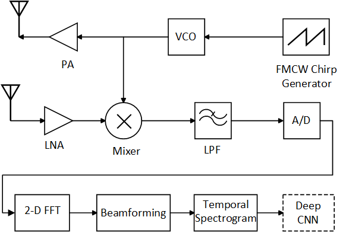
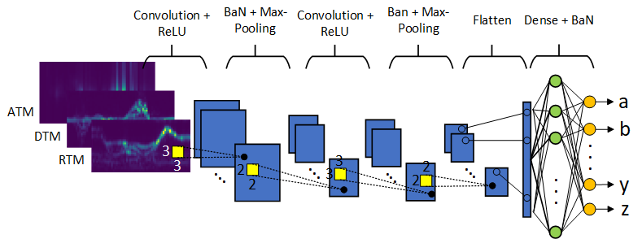
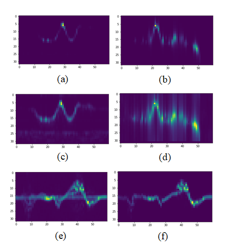
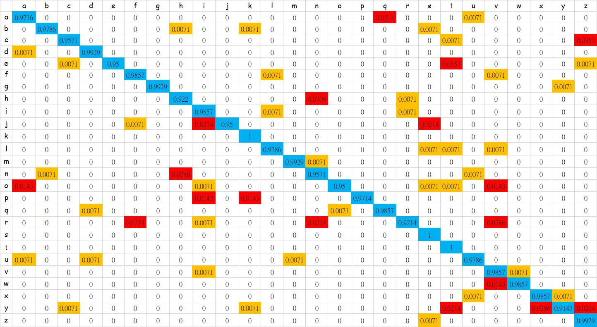
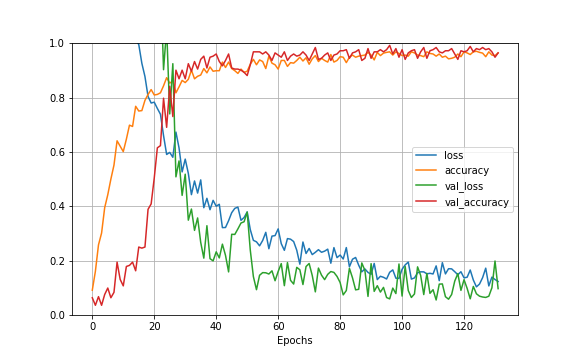

## 27th International Conference on Pattern Recognition (ICPR2024)
### mmAlphabet: Air Writing Alphabet Recognition System Based on mmWave FMCW Radar and Convolutional Neural Network

An air writing alphabet recognition system based on the images of temporal spectrogram such as average range-time map, average Doppler-time map and average angle-time map derived from an mmWave FMCW radar is proposed. All 26 English lowercase letters written in midair right above the radar sensor can be recognized. Two valuable radar data sets are introduced in diverse environments such as meeting room, office cubicle and living room etc. The use case is the usage scenarios of laptop computers and mobile phones. In one data set, volunteers write freely in their own handwriting styles including different hand speeds and different stroke orders. In the other data set, volunteers are asked to write according to a prescribed sequence of strokes. Then, the gestures sensed by radar are processed into images of temporal spectrogram to represent the written letter. A convolutional neural network which achieves 98.6% test accuracy is exploited as the classifier to recognize the air written alphabet. In the Leave-One-Subject-Out (LOSO) cross validation, it achieves an average test accuracy of 87.74%. The effectiveness of the proposed alphabet recognition system is extensively verified on the two created data sets for different variants of temporal spectrograms. It can be used to implement natural, intelligent noncontact human machine interface.

#### Performance Evaluation

#### See also

* [mmAlphabet: Air Writing Alphabet Recognition System Based on mmWave FMCW Radar and Convolutional Neural Network](https://link.springer.com/chapter/10.1007/978-3-031-78104-9_29)
